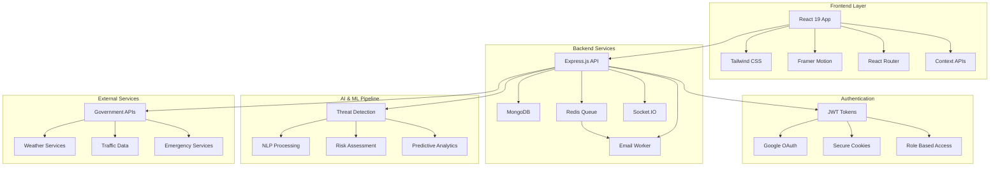

# 🏗️ SafeSpace - Technical Architecture

## 🎯 **System Architecture Overview**



## 🔧 **Component Architecture**

### **Frontend Architecture**
```
SafeSpace React App
├── 🎨 Presentation Layer
│   ├── Pages (Dashboard, Profile, Landing)
│   ├── Components (Threat Cards, Modals, Heatmap)
│   └── Layout (Navbar, Footer, Sidebar)
│
├── 🧠 Business Logic Layer
│   ├── Context (Auth, Theme, Notifications)
│   ├── Hooks (Custom React hooks)
│   └── Utils (API clients, helpers)
│
├── 📡 Data Layer
│   ├── API Services (Axios clients)
│   ├── Local Storage (Preferences)
│   └── Cache Management (React Query)
│
└── 🎯 Infrastructure
    ├── Routing (React Router DOM)
    ├── State Management (Context + useReducer)
    └── Performance (Code splitting, lazy loading)
```

### **Backend Architecture**
```
Node.js Express Server
├── 🛡️ Security Layer
│   ├── Authentication (JWT, OAuth)
│   ├── Authorization (RBAC)
│   ├── Rate Limiting
│   └── Input Validation (Zod)
│
├── 🔀 API Layer
│   ├── Auth Routes (/auth/*)
│   ├── Threat Routes (/api/threats/*)
│   ├── User Routes (/api/users/*)
│   └── Notification Routes (/api/notifications/*)
│
├── 🧠 Business Logic
│   ├── Threat Processing
│   ├── User Management
│   ├── Notification Engine
│   └── Analytics Engine
│
├── 📊 Data Layer
│   ├── MongoDB Models
│   ├── Redis Cache
│   ├── File Storage (Cloudinary)
│   └── Queue Management (BullMQ)
│
└── 🌐 External Integrations
    ├── Email Service (Nodemailer)
    ├── SMS Service (Twilio)
    ├── Government APIs
    └── Social Media APIs
```

## 🔄 **Data Flow Architecture**

### **Real-Time Threat Processing**
```
External Data Sources
        ↓
    Data Ingestion API
        ↓
    AI Processing Engine
        ↓
   Threat Classification
        ↓
    Risk Assessment
        ↓
   Database Storage
        ↓
  WebSocket Broadcasting
        ↓
    Frontend Updates
        ↓
   User Notifications
```

### **User Authentication Flow**
```
User Login Request
        ↓
   Input Validation
        ↓
  Password Verification
        ↓
   JWT Token Generation
        ↓
   Secure Cookie Setting
        ↓
  Frontend State Update
        ↓
  Protected Route Access
```


### **Redis Data Structures**

#### **Caching Strategy**
```javascript
// User sessions (30 min TTL)
"session:user:${userId}" → {user data}

// Threat cache (5 min TTL)
"threats:city:${cityName}" → [threat objects]

// API rate limiting (1 hour TTL)
"ratelimit:${ipAddress}" → counter

// Real-time stats (1 min TTL)
"stats:dashboard" → {metrics object}
```

#### **Queue Management**
```javascript
// Email queue
"queue:email" → [
  {
    type: "welcome",
    to: "user@email.com",
    data: {userId, name}
  }
]

// Notification queue
"queue:notifications" → [
  {
    type: "threat_alert",
    users: [userId1, userId2],
    threat: threatData
  }
]
```

## 🔒 **Security Architecture**

### **Authentication & Authorization**
```
┌─────────────────────────────────────┐
│          Client Request             │
├─────────────────────────────────────┤
│ 1. HTTPS Enforcement                │
│ 2. CORS Validation                  │
│ 3. Rate Limiting Check              │
│ 4. JWT Token Verification           │
│ 5. Role-Based Access Control        │
│ 6. Input Validation (Zod)           │
│ 7. SQL Injection Prevention         │
│ 8. XSS Protection                   │
└─────────────────────────────────────┘
```

### **Data Protection**
```
┌─────────────────────────────────────┐
│         Data Security Stack         │
├─────────────────────────────────────┤
│ 🔐 AES-256 Encryption at Rest      │
│ 🛡️ TLS 1.3 for Data in Transit    │
│ 🔑 bcrypt for Password Hashing     │
│ 🎫 JWT with RS256 Algorithm        │
│ 🛡️ HttpOnly Secure Cookies        │
│ 🔒 Environment Variable Secrets    │
│ 📝 Audit Logging for Compliance    │
└─────────────────────────────────────┘
```

## ⚡ **Performance Optimization**

### **Frontend Optimization**
```javascript
// Code Splitting
const Dashboard = lazy(() => import('./pages/Dashboard'));
const Profile = lazy(() => import('./pages/Profile'));

// Image Optimization


// API Caching
const { data, isLoading } = useQuery(
  ['threats', cityId],
  () => fetchThreats(cityId),
  { staleTime: 5 * 60 * 1000 } // 5 minutes
);
```

### **Backend Optimization**
```javascript
// Database Indexing
db.threats.createIndex({ location: "2dsphere" });
db.threats.createIndex({ level: 1, createdAt: -1 });
db.users.createIndex({ email: 1 }, { unique: true });

// Query Optimization
const threats = await Threat.find({ city })
  .select('title level location createdAt') // Only needed fields
  .limit(20)
  .sort({ createdAt: -1 })
  .lean(); // Return plain objects

// Caching Strategy
const cachedThreats = await redis.get(`threats:${city}`);
if (!cachedThreats) {
  const threats = await fetchThreatsFromDB(city);
  await redis.setex(`threats:${city}`, 300, JSON.stringify(threats));
  return threats;
}
```
